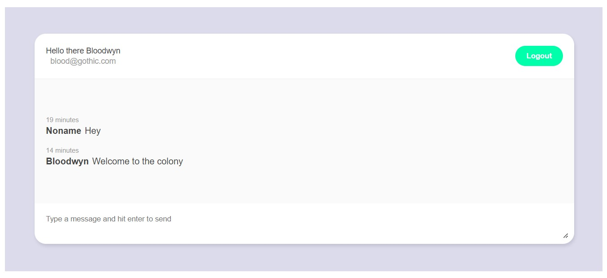

## Table of contents

  - [The challenge](#the-challenge)
  - [Screenshot](#screenshot)
  - [Links](#links)
  - [Built with](#built-with)
  - [Useful resources](#useful-resources)
  - [Author](#author)

### The challenge

Private chat room, 
Users should be able to:

- Sing in
- Log out
- Send a message

### Screenshot

### Links

- Live Site URL: [https://vue-blog-de285.web.app/](https://vue-blog-de285.web.app/chatroom)

### Built with

- Mobile-first workflow
- [Vue.js](https://vuejs.org/) - Framework
- [Firebase](https://firebase.google.com/) - Backend

### Useful resources

- [Firebase by Net ninja](https://www.youtube.com/watch?v=aN1LnNq4z54&list=PL4cUxeGkcC9jUPIes_B8vRjn1_GaplOPQ) - This helped me set backend. I really liked this pattern and will use it going forward.

## Author

- Linkedin - [Kamil Kałuża](https://www.linkedin.com/in/kamil-ka%C5%82u%C5%BCa-3b49a1250/)